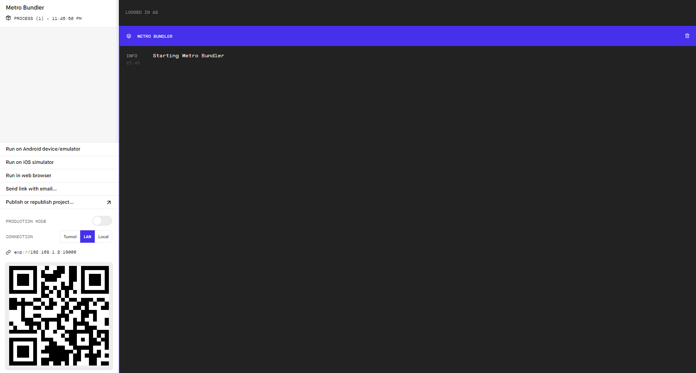

# Space News Reader

## Project Overview

This projects is a simple reader to fetch data from [Spaceflight News API](https://www.spaceflightnewsapi.net/).

The project makes use of:
* React Native
* React Native Paper (MaterialUI implementation for React Native)
* Redux (State management)
* Redux Thunk (Redux middleware for async)


## Installation

**Install `expo` ( if not yet installed )**

```
npm install expo-cli --global
```

**Install the npm dependencies**

```
npm install
```

**Open a simulator (can be an Android / iOS device)**

Open an Android or iOS simulator (by using Android Studio or XCode)

**Run the project**

```
npm run start
```

**Deploy to simulator**

A browser will popup showing expo dev tools



click `Run on Android` or `Run on iOS` depending on the simulator being used (can also run both)

Note: if it fails to load, try to click `Tunnel` before clicking run, this will change the way the app is being served
